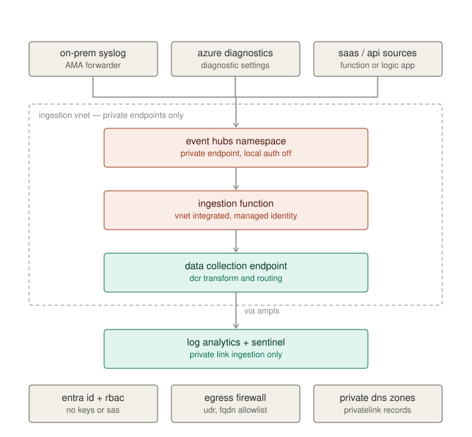

# Secure Sentinel ingestion

[](https://github.com/Oreedtech/sentinel-secure-ingestion/actions/workflows/verify.yml)

A private-only log ingestion pipeline for Microsoft Sentinel, built with Terraform and
verified in CI.

Event Hubs receives logs over a private endpoint with SAS authentication disabled entirely.
A VNet-integrated function consumes the stream using a system-assigned managed identity and
writes to Log Analytics through a data collection endpoint over Azure Monitor Private Link.
No component is reachable from the public internet, and no credential exists anywhere in
the configuration.



## The security properties this claims

Every one is asserted by a policy check that runs on each commit, so a change that reopens
the boundary fails the build rather than shipping.

| Property | Enforced by |
|----------|-------------|
| SAS authentication is not an available path | `CKV_OREED_1` |
| No data-plane resource accepts public traffic | `CKV_OREED_2` |
| Sentinel ingests over private link only | `CKV_OREED_3` |
| Storage account keys are disabled | `CKV_OREED_4` |
| Every private endpoint has a DNS zone group | `CKV_OREED_5` |
| All function egress traverses the NSG and route table | `CKV_OREED_6` |
| Every role assignment targets a managed identity | `CKV_OREED_7` |

`CKV_OREED_5` is the one worth reading the implementation of. A private endpoint without a
DNS zone group deploys cleanly and reports healthy, but the hostname still resolves to a
public IP — so traffic either leaves the VNet or gets dropped by the firewall and presents
as an unrelated network fault. It is the most common way this architecture is built wrong.

### Policy exceptions

Checkov's built-in Azure ruleset also runs. Where a finding is right, it is fixed. Where it
conflicts with a deliberate decision, it is suppressed inline with a written reason rather
than by loosening the scan:

```bash
grep -rn "checkov:skip" terraform/
```

Two are worth calling out. `CKV_AZURE_36` wants the `AzureServices` bypass on the function's
storage account — this design refuses it, because the account is reached only over private
endpoints and the bypass would widen its network posture for no functional gain. That is a
case of the code being *stricter* than the check. `CKV2_AZURE_1` wants customer-managed
keys, which this genuinely does not implement; it is suppressed pointing at gap 2 of the
[threat model](docs/threat-model.md) rather than quietly passed.

`CKV2_AZURE_21` is the sharpest version of the first case. It asks that blob read requests be
logged, and accepts only one implementation: an `azurerm_log_analytics_storage_insights`
resource, whose `storage_account_key` argument the provider marks *required*. This account
sets `shared_access_key_enabled = false`, and `CKV_OREED_4` fails the build if that ever
changes. Reads *are* audited — `azurerm_monitor_diagnostic_setting.capture_blob` streams
`StorageRead`, `StorageWrite` and `StorageDelete` to Log Analytics with no credential
involved. Passing the check literally would mean reintroducing an account key in order to
log the reads of an account whose reads are already logged. The check encodes an
implementation; the control it stands for is met by a stronger one.

An exception with a reason attached is a decision. One without is a gap.

## Verifying it

No Azure subscription or credentials required. `terraform init -backend=false` resolves
providers without contacting Azure.

```bash
cd terraform
terraform init -backend=false
terraform validate

cd ..
pip install checkov
checkov --directory terraform --external-checks-dir policy/checkov --framework terraform
```

CI additionally runs `terraform fmt`, `tflint`, and `gitleaks`. See
[.github/workflows/verify.yml](.github/workflows/verify.yml).

## Layout

```
terraform/           network, DNS, Event Hubs, storage, function, Monitor, RBAC
policy/checkov/      custom policies asserting the controls above
detections/          Sentinel analytics rules (KQL)
docs/                architecture diagram, threat model, cost notes
```

## Detections

Three analytics rules, each tied to a specific property of this architecture rather than
generic content:

- **[private-link-config-drift](detections/private-link-config-drift.kql)** — someone flips
  a resource back to public. A one-line ARM write that produces no data-plane signal and
  leaves every downstream control reporting healthy.
- **[eventhub-local-auth-attempt](detections/eventhub-local-auth-attempt.kql)** — SAS
  authentication attempted against a namespace where it is disabled. It cannot succeed,
  which is what makes it useful signal: nothing legitimate ever tries.
- **[ingestion-pipeline-stall](detections/ingestion-pipeline-stall.kql)** — volume drops
  against a source's own rolling baseline. A fail-closed pipeline goes quiet rather than
  erroring, so silence is the only available detection surface.

## Design decisions worth explaining

**Logs Ingestion API over the built-in Event Hub connector.** The built-in connector is
simpler but cannot be fully private-linked and offers no transformation. Routing through a
DCR gives server-side filtering and an explicit schema, and keeps every hop inside the VNet.

**RBAC scoped to the DCR, not the workspace.** `Monitoring Metrics Publisher` on the rule
lets the identity submit records through that one path. It cannot read Sentinel, query
existing data, or alter anything already stored — a meaningful reduction in what a
compromised function is worth.

**Event Hubs Capture is on by default.** A private-only pipeline has no fallback. Without an
independent archive, an outage downstream of the hub is permanent log loss. Capture makes it
a replay job instead.

**Azure Firewall is opt-in.** It costs roughly $900/month for existence alone, which puts it
out of reach of a lab subscription. `enable_forced_tunneling` defaults to `false`, and the
resulting weaker egress posture is recorded as a known gap rather than glossed over. See
[cost notes](docs/cost-notes.md).

## What this does not cover

Listed explicitly, because a design that claims complete coverage is not credible. The full
version is in the [threat model](docs/threat-model.md).

- Control-plane changes are **detected, not prevented**. Blocking them needs Azure Policy
  with `deny` effects at management-group scope, plus PIM — both above workload scope.
- Encryption at rest uses platform-managed keys. No CMK.
- How on-prem forwarders obtain and rotate their Entra ID credentials is assumed, not solved.
- Capture storage requires the `AzureServices` trusted-services bypass, a real widening of
  that account's network posture, accepted for the replay path.

## Status

Authored and structurally reviewed; CI is the source of truth for whether it validates —
see the badge above rather than taking this file's word for it.

It has **not** been deployed to a live subscription. See [cost notes](docs/cost-notes.md)
for what that would cost and which components are viable on a trial account. Two areas are
most likely to need adjustment on a first real run: the `azapi_resource` body shape for the
custom `_CL` table (azurerm has no resource for creating one), and provider-version
sensitivity around `azurerm_storage_container.storage_account_id`.
